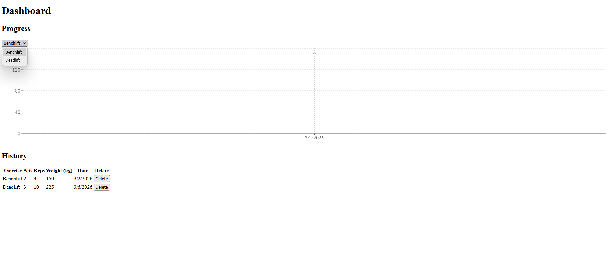

# Workout Tracker Web App

A full-stack fitness tracking application built with React and FastAPI. Users can log workouts, track exercises, and manage their fitness history through a clean and responsive interface.

## Tech Stack

**Frontend**
- React (Vite)
- React Router
- CSS

**Backend**
- FastAPI
- Python
- SQLite
- SQLAlchemy
- JWT Authentication (bcrypt)

## Features

- User registration and login with secure JWT authentication
- Create, view, and delete workout sessions
- Track exercises, sets, reps, and weight per session
- Protected routes — data is private to each user
- RESTful API with full CORS configuration

## Project Structure
```
workout-tracker/
├── backend/
│   ├── main.py
│   ├── models.py
│   ├── database.py
│   ├── auth.py
│   └── routes/
├── frontend/
│   ├── src/
│   │   ├── components/
│   │   ├── pages/
│   │   └── main.jsx
│   └── vite.config.js
└── README.md
```

## Getting Started

### Prerequisites
- Python 3.10+
- Node.js 18+

### Backend Setup
```bash
cd backend
python -m venv venv
source venv/bin/activate  # Windows: venv\Scripts\activate
pip install -r requirements.txt
uvicorn main:app --reload
```

### Frontend Setup
```bash
cd frontend
npm install
npm run dev
```

The app will be running at `http://localhost:5173` and the API at `http://localhost:8000`.

## API Endpoints

| Method | Endpoint | Description |
|--------|----------|-------------|
| POST | `/auth/register` | Register a new user |
| POST | `/auth/login` | Login and receive JWT token |
| GET | `/workouts` | Get all workouts for current user |
| POST | `/workouts` | Create a new workout session |
| DELETE | `/workouts/{id}` | Delete a workout session |

## Screenshots

